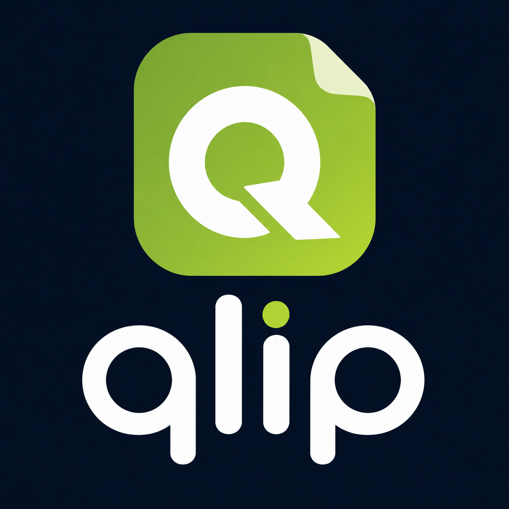

# Qlip

<p align="center">
  
</p>

<p align="center">
  <strong>Save, organize, and rediscover your links with AI-powered intelligence</strong>
</p>

<p align="center">
  <a href="#features">Features</a> •
  <a href="#screenshots">Screenshots</a> •
  <a href="#installation">Installation</a> •
  <a href="#usage">Usage</a> •
  <a href="#tech-stack">Tech Stack</a> •
  <a href="#architecture">Architecture</a>
</p>

---

## Overview

This is the **Qlip iOS app** — the phone client for Qlip, an AI knowledge vault it shares with the [Qlip web app](https://github.com/mohamedatef90/bentolinks-ai) over one Supabase backend. Save a link from the iOS share sheet and it syncs to the cloud, where it's fetched, read, and **AI-enriched server-side** (title, summary, key points, topic, tags), then streamed back to your phone. Everything you save on your phone is also there on the web, and vice-versa.

> **Note:** AI now runs **server-side** in Supabase Edge Functions (NVIDIA + Gemini), not on-device. The app just saves URLs and displays the enriched results; no AI key lives in the app.

## Features

### Core
- **iOS Share Extension** — save links from any app via the share sheet; they upload to the cloud vault and enrich automatically.
- **Cloud sync** — Supabase-backed, with an offline queue that flushes on reconnect and a **"Sync all links"** action to back-fill older local-only saves.
- **Live updates** — items stream from `pending → parsing → enriching → ready` via Supabase Realtime.

### AI-powered (server-side)
- **Enrichment on everything** — every link gets an AI title, summary, key points, topic, and tags via a two-tier NVIDIA router (`gpt-oss-20b` / `glm-5.2`) with a Gemini fallback.
- **Social & media fetching** — YouTube, X/Twitter, Reddit, PDF, and **Instagram / TikTok / Facebook** are scraped and transcribed on the backend (Apify + Gemini), so reels and posts get real content summaries.
- **Reader** — full-screen reader with the article/post image, AI summary, key points, and a **Translate to Arabic** button (RTL).

### Organize & discover
- **Folders (categories)** — bookmark rows show website favicons + AI summaries.
- **Feeds** — subscribe to RSS/Atom feeds, manage sources (sync / pause / unsubscribe), and browse a "Fresh from your feeds" 48h stream.
- **Platform folders, topics & tags** — browse by source, category, or auto-generated tags.
- **Duplicate detection**, manual overrides, and a dark **magic_black** UI.

## Screenshots

<!-- Add your screenshots here -->
<!--
<p align="center">
  
  
  
  
</p>
-->

## Installation

### Prerequisites
- Flutter SDK ^3.10.1
- Xcode (for iOS development)
- CocoaPods

### Setup

1. **Clone the repository**
   ```bash
   git clone https://github.com/yourusername/linkat.git
   cd linkat
   ```

2. **Install dependencies**
   ```bash
   flutter pub get
   ```

3. **Generate Isar database code**
   ```bash
   flutter pub run build_runner build --delete-conflicting-outputs
   ```

4. **Backend config**

   None needed to run — the Supabase URL and public anon key are set in `lib/main.dart`, and all AI/model keys live server-side in Supabase Vault. Just sign in and start saving.

5. **Generate app icons**
   ```bash
   flutter pub run flutter_launcher_icons
   ```

6. **Run the app**
   ```bash
   flutter run
   ```

### iOS Release Build

```bash
# Clean and get dependencies
flutter clean
flutter pub get

# Build for release
flutter build ios --release

# Open in Xcode for signing
open ios/Runner.xcworkspace
```

In Xcode:
1. Select your physical iPhone from the device dropdown
2. Configure signing for both "Runner" and "ShareExtension" targets
3. Press `Cmd + R` to build and run

## Usage

### Saving a Link

**Method 1: In-App**
1. Open Qlip
2. Tap the "+" button
3. Paste or type the URL
4. (Optional) Expand "Advanced Options" to add custom title, description, or tags
5. (Optional) Select a topic category
6. Tap "Save Link"

**Method 2: Share Extension**
1. In any app (Safari, social media, etc.), find a link you want to save
2. Tap the Share button
3. Select "Qlip" from the share sheet
4. The link will be saved automatically with AI processing

### Browsing Links

- **Home Screen** - See all platforms as folders with link counts
- **Platform Folders** - Tap a platform to see all links from that source
- **Topics** - Browse links by category
- **Tags** - Search and filter by tags

### Managing Links

- **View Details** - Tap any link to see full details, AI summary, and translation options
- **Change Topic** - In link details, tap the topic badge to reassign
- **Delete** - Swipe or use the delete option in link details
- **Share** - Share links directly from the app

## Tech Stack

- **Framework**: Flutter (Dart 3)
- **State Management**: Riverpod
- **Local Database**: Isar (offline cache + sync queue)
- **Routing**: go_router
- **Backend**: Supabase (`supabase_flutter`) — Auth, Postgres (RLS), Edge Functions, Realtime
- **AI/ML**: server-side (NVIDIA `gpt-oss-20b`/`glm-5.2` + Google Gemini) via Qlip Edge Functions — nothing runs on-device
- **Media**: cached_network_image, url_launcher

## Architecture

The app follows Clean Architecture principles with three main layers:

```
lib/
├── data/
│   ├── models/          # Isar database models
│   ├── repositories/    # Repository implementations
│   └── services/        # External services (metadata, AI, etc.)
├── domain/
│   ├── entities/        # Core business objects
│   ├── repositories/    # Repository interfaces
│   └── usecases/        # Business logic operations
├── presentation/
│   ├── providers/       # Riverpod providers
│   ├── screens/         # UI screens
│   ├── theme/           # App theming
│   └── widgets/         # Reusable components
└── services/
    └── share_handler/   # iOS Share Extension handling
```

### Key Components

| Component | Description |
|-----------|-------------|
| `SyncService` | Two-way cloud sync (server-wins): push queued local ops, pull server changes, back-fill local-only rows |
| `SupabaseDatasource` | Qlip backend access — `save-item`/`translate`/`discover-feed`/`rss-poller` Edge Functions, content_items, folders, feeds, Realtime |
| `MetadataService` | Fetches OpenGraph metadata for an instant local preview (server re-parses for the real data) |
| `PlatformDetectionService` | Identifies social platforms from URLs |
| `LinkRepository` / `IsarSyncLocalStore` | Local Isar cache + sync queue |

> Enrichment (title, summary, key points, tags), social scraping, translation, and search all happen **server-side** in Supabase Edge Functions — the app never calls an AI model directly.

## iOS Share Extension

The app includes an iOS Share Extension for saving links from any app. Setup instructions are in `ios/ShareExtension/SHARE_EXTENSION_SETUP.md`.

Key points:
- Requires App Groups configuration
- Both main app and extension must share the same App Group
- Links shared via extension are processed when the main app opens

## Backend

Qlip talks to the shared Supabase project. The Supabase URL + public anon key are in `lib/main.dart`; access is enforced by Row-Level Security and Auth. All AI provider keys (NVIDIA, Gemini, Apify) are stored in Supabase Vault and used only by Edge Functions — **no secrets ship in the app**.

## Contributing

Contributions are welcome! Please feel free to submit a Pull Request.

1. Fork the repository
2. Create your feature branch (`git checkout -b feature/AmazingFeature`)
3. Commit your changes (`git commit -m 'Add some AmazingFeature'`)
4. Push to the branch (`git push origin feature/AmazingFeature`)
5. Open a Pull Request

## License

This project is licensed under the MIT License - see the [LICENSE](LICENSE) file for details.

## Acknowledgments

- [Flutter](https://flutter.dev/) - UI framework
- [Riverpod](https://riverpod.dev/) - State management
- [Isar](https://isar.dev/) - Local database
- [Google Gemini](https://ai.google.dev/) - AI capabilities
- [Font Awesome](https://fontawesome.com/) - Icons

---

<p align="center">
  Made with ❤️ using Flutter
</p>
